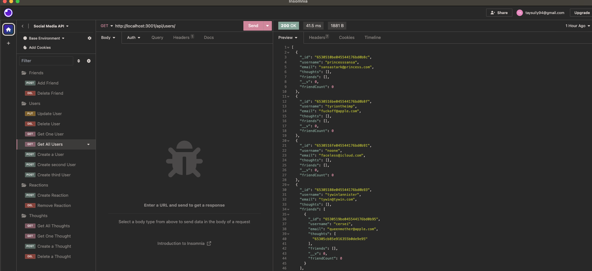
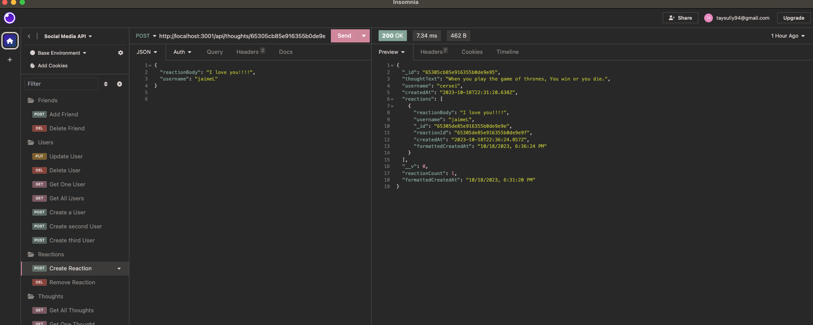
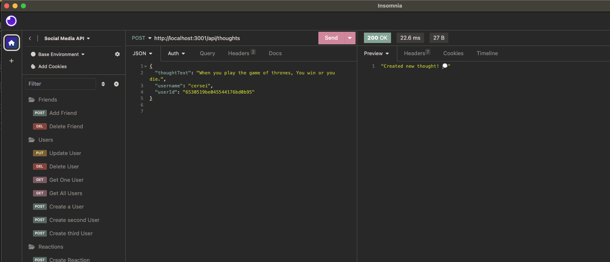

# Social Media Backend

## A fully functioning backend for your next social media platform!

I wanted to create an easily usable backend that establishes a user base, can establish friends relationships, can add posts (called Thoughts), and where people can react to Thoughts with Reactions.

Maybe a build my own social media next!

## Table of Contents

- [Installation](#installation)
- [Usage](#usage)
- [Credits](#credits)
- [License](#license)
- [Questions](#questions)

## Installation

In order to check this application out, you will need to have a coding application and run an npm i for the packages necessary.

## Usage/Tests

Once you're set up in the coding application of your choice, run node index.js in the terminal to start the server. When the server is started, you can make calls through insomnia to see how the data reacts.
You can create a user, add friends, remove friends, add thoughts, react to those thoughts, and see which data is related to which user. Enjoy! 
Checkout this walk through for more a thorough demo: [Click Here!](https://watch.screencastify.com/v/rgW4WYUzodfP4bNChho1)

## Contributing

The collaborators on this project include me, myself, and I -- tayskully

Tutorials followed include Columbia University EdX's Coding Bootcamp 2023, as well as:  
 [Github Docs](https://docs.github.com/en)  
 [developer mozilla](https://developer.mozilla.org/en-US/)  
 [Dev.to](https://dev.to/)  
 [Code Academy blogs](https://www.codecademy.com/resources/blog/)  
 [W3 Schools](https://www.w3schools.com/)

Special thanks to Erik Hirsch, my tutor,for the additional guidance!

## License

    MIT License

## Questions

Reach out to me if you have any questions!

- Github: [tayskully](https://github.com/tayskully)
- LinkedIn: [linkedin.com/taylordaniellesullivan](https://www.linkedin.com/in/linkedin.com/taylordaniellesullivan/)
- Email: taysully94@gmail.com

---

## Badges

